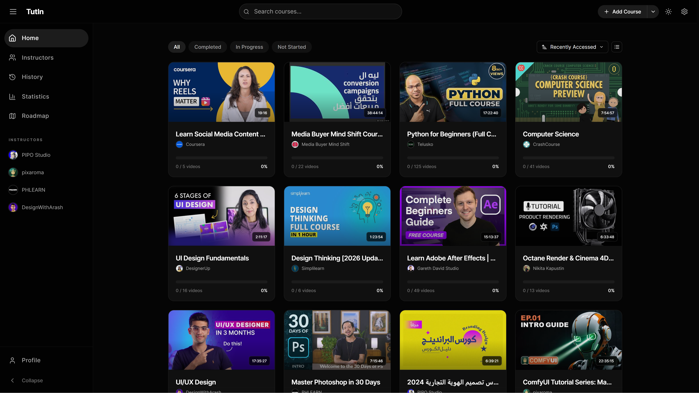

# TutIn - AI-Powered Course Learning Platform

> **Lock In & Learn** - Your offline-first, AI-enhanced video course management system

TutIn is a modern, powerful course learning platform that helps you organize, track, and master video courses from multiple sources. Built with React and powered by cutting-edge AI, it works completely offline after initial setup and gives you full control over your learning journey.



## ✨ Why TutIn?

- 🚀 **Offline-First**: All data stored locally, works without internet
- 🤖 **AI-Powered**: In-browser transcription + AI summarization
- 📊 **Visual Learning**: Interactive roadmap for course dependencies
- 🎯 **Multi-Source**: Import from local files, YouTube, or Google Drive
- 💾 **Privacy-Focused**: No cloud, no tracking, your data stays yours
- ⚡ **Performance**: Fast, responsive, built with modern web technologies

---

## 📋 Table of Contents

- [Features](#-features)
- [Screenshots](#-screenshots)
- [Getting Started](#-getting-started)
- [Usage](#-usage)
- [Architecture](#-architecture)
- [Keyboard Shortcuts](#%EF%B8%8F-keyboard-shortcuts)
- [Configuration](#%EF%B8%8F-configuration)
- [Browser Support](#-browser-support)
- [Troubleshooting](#-troubleshooting)
- [Contributing](#-contributing)

---

## 🎯 Features

### 📚 Course Management

#### Multi-Source Import
- **Local Courses**: Import video courses from local folders with automatic module detection
- **YouTube Integration**: Import entire playlists with automatic metadata fetching and channel avatars
- **Google Drive**: Import videos directly from your Google Drive
- **Smart Preview**: Preview and edit course structure before importing
- **Persistent Access**: Set a root folder once, restore access automatically on next session

#### Organization & Search
- **Custom Tags**: Organize courses with custom tags for easy categorization
- **Global Search**: Instantly find courses by name or description
- **Smart Filtering**: Filter by status (All, Completed, In Progress, Not Started) or custom tags
- **Multiple Sort Options**: Sort by name, progress, date added, or total duration
- **Module Management**: Edit and reorder modules, drag-and-drop video organization

### 🎬 Advanced Video Player

#### Playback Features
- **Custom Controls**: Full-featured video player with native and custom controls
- **Picture-in-Picture**: Watch while working on other tasks
- **Speed Control**: Adjust playback speed (0.25x - 2x)
- **Auto-Resume**: Automatically resume from last watched position
- **Auto-Play Next**: Seamlessly continue to next video in the playlist
- **Hold-to-Speed-Up**: Hold a key for 2x speed (YouTube-style)
- **Multiple Formats**: Support for MP4, WebM, HLS, YouTube, Google Drive, and more

#### Player Controls
- **Volume Control**: Persistent volume settings
- **Fullscreen Mode**: Immersive learning experience
- **10-Second Skip**: Quick intro/outro skipping
- **Seek Controls**: 5-second forward/backward seeking
- **Progress Tracking**: Visual progress bar with hover preview

#### Closed Captions
- **Dynamic Positioning**: YouTube-style caption positioning that avoids controls
- **Draggable**: Manually reposition captions anywhere on screen
- **Timestamped**: Click any caption to jump to that moment
- **WebVTT Support**: Industry-standard caption format

### 🤖 AI-Powered Features

#### Transcription (Whisper AI)
- **In-Browser Processing**: Runs completely offline using Transformers.js
- **Whisper Tiny Model**: ~40MB download, cached locally after first use
- **Web Worker**: Non-blocking transcription won't freeze UI
- **High Accuracy**: State-of-the-art speech recognition
- **Timestamp Support**: Word-level timestamps for captions
- **Click-to-Seek**: Click any transcript word to jump to that moment

#### AI Summarization (Gemini 2.0 Flash)
- **Structured Summaries**: Auto-generated title, bullet points, notes, and action items
- **Smart Extraction**: Key concepts and learning objectives
- **Markdown Rendering**: Beautiful typography for summaries
- **Regenerate**: Re-run summarization with existing transcript
- **Fallback Mode**: Extractive summary if API is unavailable
- **Export**: Download transcripts and summaries as markdown

### 📊 Learning Analytics

#### Progress Tracking
- **Dual Modes**: Track by video count OR watch time
- **Completion Thresholds**: Choose 90%, 95%, or 100% threshold for auto-completion
- **Smart Sorting**: In-progress courses sorted by completion percentage
- **Manual Override**: Mark videos as complete/incomplete manually
- **Resume Tracking**: Always know where you left off

#### Statistics Dashboard
- **Learning Metrics**: Total courses, completed courses, videos watched
- **Time Tracking**: Total watch time, average session duration
- **Progress Charts**: Visual charts using Recharts library
- **Completion Rates**: Track your learning velocity
- **Course Analytics**: Per-course statistics and insights

#### Watch History
- **Recently Watched**: Quick access to your latest videos
- **History Log**: Complete watch history with timestamps
- **One-Click Resume**: Jump back into any video instantly

### 👥 Instructor Management

- **Instructor Pages**: Browse all courses by instructor
- **Avatar Support**: Automatic avatar fetching for YouTube instructors
- **Centralized Storage**: Deduplicated avatar storage across courses
- **Instructor Profiles**: View all courses from a specific instructor
- **Quick Navigation**: Filter and find courses by instructor

### 🗺️ Visual Roadmap Builder

#### Interactive Canvas
- **Drag-and-Drop**: Position course nodes anywhere on canvas
- **Zoom & Pan**: Navigate large roadmaps with zoom controls
- **Grid Snapping**: Optional grid for precise alignment
- **Infinite Canvas**: Unlimited space for your learning path

#### Course Connections
- **Visual Links**: Draw connections between prerequisite courses
- **Bezier Curves**: Smooth, professional-looking connections
- **Smart Routing**: Automatic edge detection for optimal connection points
- **Hover Effects**: Highlight connection paths on hover
- **Remove Connections**: Click or double-click to remove links

#### Roadmap Management
- **Multiple Roadmaps**: Create different paths for different goals
- **Save/Load**: Persist roadmaps in IndexedDB
- **Export/Import**: Share roadmaps as JSON files
- **Course Status**: Visual indicators for completed/in-progress courses

### 📝 Notes & Annotations

- **Timestamped Notes**: Add notes at specific video moments
- **Rich Editor**: Format notes with markdown support
- **Click-to-Seek**: Jump to any note's timestamp instantly
- **Edit & Delete**: Full CRUD operations on notes
- **Copy Notes**: Quick copy to clipboard
- **Export as Markdown**: Download all notes for a video
- **Favorites**: Star important videos for quick access

### ⚙️ Settings & Customization

#### Appearance
- **Theme Toggle**: Dark mode, Light mode, or System preference
- **Accent Colors**: Customizable accent color
- **Responsive Design**: Works on desktop, tablet, and mobile
- **Glassmorphism UI**: Modern, beautiful interface design

#### Playback
- **Default Speed**: Set your preferred playback speed
- **Auto-Play**: Enable/disable auto-play next video
- **Completion Threshold**: Choose automatic completion percentage
- **Progress Mode**: Track by video count or watch time

#### Data Management
- **Export All Data**: Backup courses, progress, notes, and settings as JSON
- **Import Data**: Restore from backup file
- **Reset App**: Clear all data and start fresh
- **Folder Handles**: Persistent folder access across sessions

---

## 📸 Screenshots

> *Screenshots coming soon - the app features a sleek dark theme with glassmorphism design*

---

## 🚀 Getting Started

### Prerequisites

- **Node.js** 18 or higher
- **npm** or **yarn** package manager
- **Modern Browser**: Chrome, Edge, or Opera (for File System Access API)

### Installation

```bash
# Clone the repository
git clone https://github.com/yourusername/tutin.git

# Navigate to project folder
cd tutin

# Install dependencies
npm install

# Start development server
npm run dev
```

The app will be available at `http://localhost:5173`

### Environment Setup (Optional)

For AI summarization features, create a `.env` file:

```env
# OpenRouter API key for Gemini AI summarization
VITE_OPENROUTER_API_KEY=your_api_key_here
```

> **Note**: AI transcription works completely offline without any API key. Only summarization requires an API key.

### Build for Production

```bash
# Build optimized production bundle
npm run build

# Preview production build
npm run preview
```

---

## 📖 Usage

### Importing Your First Course

#### From Local Folder

1. Click **"Add Course"** button on the homepage
2. Select **"Import from Folder"**
3. Choose your course folder containing video files
4. Preview the detected modules and videos
5. Edit course title, description, and tags if needed
6. Click **"Import Course"**

**Recommended**: Set up a root folder for all your courses:
1. Go to **Settings → Data → Courses Folder**
2. Select your parent folder containing all course folders
3. On next visit, click **"Restore Access"** to reconnect (no need to re-pick)

#### From YouTube

1. Click **"Add Course"** → **"Import from YouTube"**
2. Paste a YouTube video URL or playlist URL
3. Wait for metadata to load (title, description, thumbnails)
4. Preview the playlist structure
5. Edit details if needed
6. Click **"Import"**

> **Tip**: Channel avatars are automatically fetched for YouTube playlists!

#### From Google Drive

1. Click **"Add Course"** → **"Import from Google Drive"**
2. Paste the Google Drive folder URL or video URL
3. Review the imported videos
4. Configure course details
5. Click **"Import"**

### Using AI Features

#### Transcribe a Video

1. Open any course and play a video
2. Click the **"AI Summary"** tab in the sidebar
3. Click **"Transcribe Video"**
4. Wait for the Whisper model to download (first time only, ~40MB)
5. Watch progress as transcription runs in background
6. View transcript with timestamps

#### Generate AI Summary

1. After transcription completes (or if transcript already exists)
2. Click **"Generate Summary"**
3. Wait for Gemini AI to analyze the transcript
4. View structured summary with:
   - Auto-generated title
   - Key bullet points
   - Detailed notes
   - Action items

#### Enable Closed Captions

1. After transcription, CC icon appears in video player
2. Click **CC** button to toggle captions on/off
3. Drag captions to reposition if needed
4. Captions automatically position to avoid controls

### Creating a Learning Roadmap

1. Navigate to **Roadmap** page from sidebar
2. Click **"Create New Roadmap"**
3. Give your roadmap a name
4. Click **"Add Course"** and select courses to add to canvas
5. Drag course nodes to position them
6. Click a course's connection icon, then click another course to link them
7. Use zoom controls to navigate large roadmaps
8. Click **"Save"** to persist your roadmap

### Tracking Progress

- **Automatic**: Videos auto-complete when you watch past the threshold (default 90%)
- **Manual**: Click the checkmark icon on any video to mark complete/incomplete
- **Dashboard**: View statistics on the **Statistics** page
- **Filter**: Use homepage filters to see "In Progress" or "Completed" courses

---

## 🏗️ Architecture

### Technology Stack

#### Frontend
- **React 18.3** - UI library with hooks and suspense
- **React Router 7** - Client-side routing with lazy loading
- **Vite 6** - Lightning-fast build tool and dev server
- **Tailwind CSS 3.4** - Utility-first styling with custom dark theme

#### State Management
- **React Context API** - Global state for theme, settings, sidebar, and search
- **Local State** - Component-level state with useState and useReducer

#### Storage & Persistence
- **IndexedDB** - Primary data store for courses, modules, videos, notes, instructors, roadmaps, and folder handles
- **localStorage** - User settings and preferences
- **File System Access API** - Persistent folder access for local courses

#### AI & Machine Learning
- **Transformers.js 2.17** - In-browser ML with Whisper Tiny model
- **Web Workers** - Background AI processing without blocking UI
- **OpenRouter API** - Gemini 2.0 Flash for AI summarization

#### Video Playback
- **ReactPlayer 3.4** - Universal video player component
- **YouTube iframe API** - Native YouTube player embed
- **HLS.js 1.6** - HTTP Live Streaming support
- **mpegts.js 1.8** - MPEG-TS streaming support

#### UI Libraries
- **Lucide React 0.469** - Beautiful, consistent icon set
- **Recharts 2.15** - Composable charting library
- **react-markdown 10.1** - Markdown rendering for summaries

### Project Structure

```
tutin/
├── public/                  # Static assets
├── src/
│   ├── components/
│   │   ├── common/          # Reusable UI components
│   │   │   ├── ErrorBoundary.jsx
│   │   │   ├── LoadingSpinner.jsx
│   │   │   └── NotificationToast.jsx
│   │   ├── course/          # Course management components
│   │   │   ├── CourseCard.jsx              # Course display card
│   │   │   ├── EditCourseModal.jsx        # Course editing modal
│   │   │   ├── ImportPreviewModal.jsx     # Import preview & editing
│   │   │   ├── InstructorProfileModal.jsx # Instructor details
│   │   │   ├── YouTubeImportModal.jsx     # YouTube import UI
│   │   │   └── GoogleDriveImportModal.jsx # Google Drive import UI
│   │   ├── layout/          # App layout components
│   │   │   ├── Header.jsx                  # Top navigation bar
│   │   │   └── Sidebar.jsx                 # Collapsible sidebar
│   │   ├── player/          # Video player components
│   │   │   ├── VideoPlayer.jsx             # Main video player (48KB!)
│   │   │   ├── PlaylistSidebar.jsx        # Course playlist sidebar
│   │   │   ├── NotesPanel.jsx             # Timestamped notes
│   │   │   ├── AISummaryPanel.jsx         # AI transcription & summary
│   │   │   ├── EditModuleModal.jsx        # Module editing
│   │   │   └── BulkEditPlaylist.jsx       # Bulk playlist operations
│   │   └── settings/        # Settings & preferences
│   │       └── SettingsModal.jsx          # Settings modal with tabs
│   ├── contexts/            # React Context providers
│   │   ├── ThemeContext.jsx               # Dark/light theme
│   │   ├── SettingsContext.jsx            # User settings
│   │   ├── SidebarContext.jsx             # Sidebar state
│   │   └── SearchContext.jsx              # Global search state
│   ├── pages/               # Main application pages
│   │   ├── HomePage.jsx                    # Course library & filters
│   │   ├── CoursePlayerPage.jsx           # Video player page
│   │   ├── InstructorsPage.jsx            # Browse by instructor
│   │   ├── HistoryPage.jsx                # Watch history
│   │   ├── StatisticsPage.jsx             # Learning analytics
│   │   ├── RoadmapPage.jsx                # Visual course roadmap
│   │   └── ProfilePage.jsx                # User profile settings
│   ├── utils/               # Utility modules
│   │   ├── db.js                          # IndexedDB wrapper (1200+ lines)
│   │   ├── fileSystem.js                  # File System Access API
│   │   ├── aiSummarization.js            # Whisper + Gemini AI
│   │   ├── whisperWorker.js              # Web Worker for Whisper
│   │   ├── googleDrive.js                # Google Drive URL parsing
│   │   ├── timeUtils.js                  # Time formatting utilities
│   │   └── validation.js                 # Input validation
│   ├── App.jsx              # Root component with routing
│   ├── main.jsx             # Application entry point
│   └── index.css            # Global styles & Tailwind
├── index.html               # HTML template
├── package.json             # Dependencies & scripts
├── vite.config.js          # Vite configuration
├── tailwind.config.js      # Tailwind theme customization
└── README.md               # This file
```

### Data Models

#### IndexedDB Stores

1. **courses** - Course metadata
   - id, title, description, sourceType, tags, completionPercentage, etc.

2. **modules** - Module organization
   - id, courseId, title, order, videoCount

3. **videos** - Video information & progress
   - id, courseId, moduleId, title, filePath, duration, watchedDuration, completed, lastWatched

4. **notes** - Timestamped notes
   - id, videoId, timestamp, content, createdAt

5. **instructors** - Instructor data (deduplicated)
   - id (instructor name), avatar (base64), courses (array of course IDs)

6. **roadmaps** - Visual learning paths
   - id, name, nodes (courses with position), connections

7. **handles** - Persistent folder handles
   - type, handle (FileSystemHandle), path

### Key Features Implementation

- **Offline-First**: All IndexedDB operations async, no server required
- **Persistent Folder Access**: FileSystemHandle stored in IndexedDB, restored on app load
- **AI Processing**: Web Workers prevent UI blocking during transcription
- **Lazy Loading**: Pages and heavy components loaded on-demand
- **Error Boundaries**: Graceful error handling prevents app crashes
- **Responsive**: Mobile-first design with Tailwind breakpoints

---

## ⌨️ Keyboard Shortcuts

### Video Player

| Shortcut | Action |
|----------|--------|
| `Space` or `K` | Play / Pause |
| `←` | Rewind 5 seconds |
| `→` | Forward 5 seconds |
| `↑` | Volume up |
| `↓` | Volume down |
| `F` | Toggle fullscreen |
| `M` | Mute / Unmute |
| `P` | Picture-in-Picture |
| `N` | Skip intro (10 seconds forward) |
| `Shift + N` | Next video in playlist |
| `<` | Decrease playback speed |
| `>` | Increase playback speed |
| `A` | Toggle auto-play next |
| `0-9` | Seek to 0%-90% of video |

### Global

| Shortcut | Action |
|----------|--------|
| `Ctrl + K` | Focus search (if search is visible) |
| `Esc` | Close modals |

> **Tip**: Hover over buttons to see tooltips with keyboard shortcuts!

---

## ⚙️ Configuration

### Theme Customization

Edit `tailwind.config.js` to customize colors, fonts, and animations:

```javascript
theme: {
  extend: {
    colors: {
      dark: {
        bg: '#050505',      // Pure black background
        surface: '#121212', // Dark grey surface
        // ... more colors
      }
    }
  }
}
```

### Playback Settings

Configure in **Settings → Playback**:
- **Default Speed**: 0.25x to 2x
- **Auto-play Next**: Enable/disable
- **Completion Threshold**: 90%, 95%, or 100%
- **Progress Mode**: By videos or by duration

### AI Configuration

- **Whisper Model**: Currently uses `Xenova/whisper-tiny` (40MB)
- **Gemini Model**: Gemini 2.0 Flash via OpenRouter
- **Web Worker**: Enabled by default for transcription

To use AI summarization:
1. Get an API key from [OpenRouter.ai](https://openrouter.ai/)
2. Add to `.env`: `VITE_OPENROUTER_API_KEY=your_key`
3. Restart dev server

---

## 🌐 Browser Support

| Browser | Support Level | Notes |
|---------|--------------|-------|
| **Chrome** | ✅ Full Support | Recommended - all features work |
| **Edge** | ✅ Full Support | Chromium-based, all features work |
| **Opera** | ✅ Full Support | Chromium-based, all features work |
| **Brave** | ⚠️ Partial | Works, but disable Shields for File System API |
| **Firefox** | ❌ Limited | No File System Access API - use YouTube/GDrive import |
| **Safari** | ❌ Limited | No File System Access API - use YouTube/GDrive import |

### Feature Availability

| Feature | Chrome/Edge/Opera | Firefox/Safari |
|---------|------------------|----------------|
| Local folder import | ✅ | ❌ Manual file picker |
| YouTube import | ✅ | ✅ |
| Google Drive import | ✅ | ✅ |
| AI Transcription | ✅ | ✅ |
| AI Summarization | ✅ | ✅ |
| Persistent folder access | ✅ | ❌ |

---

## 🔧 Troubleshooting

### "Cannot restore folder access"

**Cause**: Browser cleared IndexedDB or folder permissions revoked

**Solution**: 
1. Go to Settings → Data → Courses Folder
2. Click "Select Root Folder" and choose your courses folder again
3. Grant permission when prompted

### AI Transcription fails or is slow

**Cause**: First-time model download or insufficient memory

**Solutions**:
- First use downloads ~40MB Whisper model - wait for it to complete
- Close other memory-intensive tabs
- Try transcribing shorter videos first
- Check browser console for specific errors

### Videos won't play

**Cause**: Browser doesn't support video format or File System API permission not granted

**Solutions**:
- Use Chrome, Edge, or Opera for best compatibility
- For local videos, ensure folder permission was granted
- For YouTube, check if video is embeddable
- For Google Drive, ensure video is set to "Anyone with link can view"

### YouTube videos not importing

**Cause**: Invalid URL, private playlist, or API rate limit

**Solutions**:
- Verify the playlist/video is public
- Check URL format (should be `youtube.com/watch?v=...` or `youtube.com/playlist?list=...`)
- Wait a few minutes if rate-limited
- Try individual video instead of entire playlist

### Export/Import data not working

**Cause**: Corrupted JSON or browser storage limits

**Solutions**:
- Ensure exported JSON file is not corrupted
- Try exporting/importing smaller batches
- Check browser console for specific errors
- Clear browser cache and try again

### App performance issues

**Cause**: Too many courses or large video files

**Solutions**:
- Use course filters to reduce visible items
- Delete unused courses
- Consider archiving old courses via export
- Restart browser to clear memory

---

## 🤝 Contributing

Contributions are welcome! Here's how you can help:

1. **Fork** the repository
2. **Create** a feature branch (`git checkout -b feature/amazing-feature`)
3. **Commit** your changes (`git commit -m 'Add amazing feature'`)
4. **Push** to the branch (`git push origin feature/amazing-feature`)
5. **Open** a Pull Request

### Development Guidelines

- Follow the existing code style (React functional components, hooks)
- Add comments for complex logic
- Test across Chrome, Edge, and Firefox
- Update documentation for new features
- Keep components small and focused

### Reporting Issues

Found a bug? Have a feature request?

1. Check if the issue already exists
2. Create a new issue with:
   - Clear description
   - Steps to reproduce (for bugs)
   - Expected vs actual behavior
   - Browser and OS version

---

## 🙏 Acknowledgments

- **[Transformers.js](https://huggingface.co/docs/transformers.js)** - Bringing ML to the browser
- **[Whisper](https://github.com/openai/whisper)** - OpenAI's speech recognition model
- **[Gemini AI](https://deepmind.google/technologies/gemini/)** - Google's advanced AI for summarization
- **[Lucide Icons](https://lucide.dev/)** - Beautiful open-source icons
- **[Tailwind CSS](https://tailwindcss.com/)** - Utility-first CSS framework
- **[Vite](https://vitejs.dev/)** - Next-generation frontend tooling
- **[React](https://react.dev/)** - The library for web interfaces

---

## 📚 Additional Resources

- **Todo & Roadmap**: See [todo.md](todo.md) for planned features and development progress
- **API Documentation**: Check source code comments in `src/utils/` for detailed API docs
- **Video Tutorial**: *(Coming soon)*

---

<div align="center">

**Made with ❤️ for learners who lock in**

</div>
