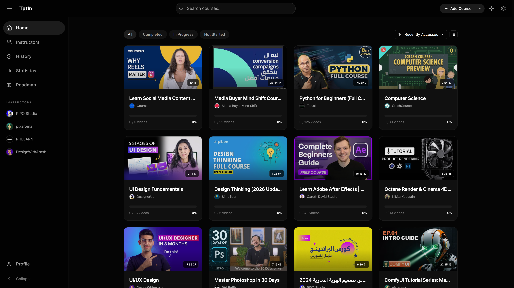

# TutIn - AI-Powered Course Learning Platform

> Your offline-first, AI-enhanced management system for local video courses and YouTube playlists.

**TutIn** is a privacy-focused, local-first learning platform designed to organize and enrich your video courses. Built with React and Vite, it allows you to mount local directories securely using the browser's File System Access API, while also offering support for online content like YouTube playlists.

## 🚀 Quick Start (Windows)

1. Double-click the `start-dev.bat` file in the root folder.
2. The script will install dependencies and launch the app in your browser automatically.

## ✨ Key Features

- **Hybrid Video Support:** Seamlessly organize local video directories as well as online YouTube playlists.
- **Privacy-First Data:** All course progress, custom roadmaps, and timestamped screenshot notes are stored entirely on your device using IndexedDB.
- **Offline AI Transcription:** Transcribe speech directly in your browser without internet using WebGPU-accelerated `Transformers.js` (Whisper).
- **AI Summaries:** Generate structured study notes from transcripts using Gemini.
- **Immersive Player:** Features timestamped rich-text notes, drag-and-drop subtitles, speed controls, and a dynamic ambient glow mode.
- **Visual Roadmap:** An interactive, drag-and-drop canvas to map out course prerequisites and learning paths.

## 📖 Usage

### Importing Courses
- **Local Folder**: Click **Add Course** -> **Import from Folder**. Select your directory, and TutIn will automatically detect modules based on subfolders.
- **YouTube/Google Drive**: Click **Add Course** and select the respective option. Paste the URL, and TutIn will fetch the metadata.

### AI Transcription & Summarization
- While playing a video, open the **AI Summary** panel in the sidebar.
- Click **Transcribe Video** to run Whisper AI entirely locally in your browser.
- Once transcribed, click **Generate Summary** to get AI-generated study notes via Gemini.

### Notes & Roadmaps
- **Timestamped Notes**: Use the Notes panel to add rich-text notes that lock to the current video timestamp. Paste or drag screenshots directly into notes.
- **Visual Roadmap**: Navigate to the Roadmap page to create custom learning paths, connecting prerequisite courses visually.

## 🏗️ Tech Stack
- **Frontend**: React 18, Vite 6, Tailwind CSS, React Router 7.
- **Backend Services**: Node.js + Express + SQLite (Companion Server for persistent streaming).
- **Storage**: IndexedDB (client-side data) & SQLite.
- **AI Processing**: Transformers.js (WebGPU Whisper) and OpenRouter API (Gemini).

## ⚙️ Configuration & API Keys

TutIn is designed to be completely offline, but you can plug in API keys to unlock advanced features:
1. Open the app and click the **Settings** gear icon.
2. Navigate to the **AI & API Keys** tab.
3. Add your **Google API Key** (for YouTube imports) and/or **OpenRouter API Key** (for Gemini summaries).

> **Note**: AI Transcription runs 100% locally on your machine via WebGPU. No API keys or internet connection are required to transcribe your videos.

 
<b>Made with ❤️ for learners who lock in</b>

