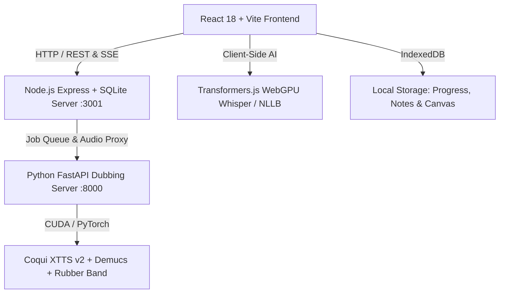

# TutIn - AI-Powered Course Learning Platform & Video Suite

<div align="center">

[](https://github.com/noureldenadel/TutIn/releases)
[](LICENSE)
[](https://reactjs.org/)
[](https://vitejs.dev/)
[](https://fastapi.tiangolo.com/)
[](https://w3.org/TR/webgpu/)

<p align="center">
  <b>Your privacy-first, offline-capable learning workstation for local video courses, YouTube playlists, and multi-lingual AI dubbing.</b>
</p>

</div>

---

## 🌟 Overview

**TutIn** is a local-first, AI-enhanced learning platform designed to organize, translate, dub, and enrich your video courses. Built with React, Vite, Node.js, and a GPU-accelerated Python FastAPI backend, TutIn mounts local folders securely via the File System Access API while seamlessly managing online YouTube playlists and cloud courses.


---

## ✨ Key Features

### 🎙️ AI Speech, Translation & Voice Dubbing
- **Offline AI Transcription (WebGPU Whisper):** Transcribe speech directly inside your browser with zero latency and zero data leakage using WebGPU-accelerated Transformers.js.
- **Neural Voice Dubbing (Coqui XTTS v2):** Clone the speaker's voice across 16+ languages with realistic timbre, emotion, and temporal alignment.
- **Vocal Separation & Audio Preservation (Demucs):** Isolate speech from background audio so course background music and sound effects are preserved cleanly during dubbing.
- **Dual-Transcript Translation (NLLB-200):** Translate subtitles with dual-cue display (simultaneous original and translated subtitles) backed by dedicated `.tts.json` speech companion tracks.
- **Modular Neural Punctuation Restoration:** Language-partitioned on-demand restoration (`Naqta` for Arabic & `FullStop-Punctuation-Multilang` for Latin/multilingual) ensuring human-readable subtitles and acoustic speech boundaries.
- **Phonetic Dialect Nudging:** Custom phonetic transformations for colloquial Arabic dialects (Egyptian, Gulf) to eliminate stiff MSA artifacts during neural synthesis.
- **Live AI Cancellation:** Instant one-click process termination for active Whisper Web Workers, SSE translation streams, and Python dubbing jobs.

### 🎓 Course Manager & Bulk Jobs
- **Course Manager & Bulk Editor:** Mass-organize playlists, adjust metadata, and manage course structures with ease.
- **Batch Processing Engine:** Queue bulk AI transcription, neural translation, and XTTS voice dubbing across entire modules and courses with real-time progress indicators.

### 🎥 Immersive Video Player
- **Smart Pauser:** Automatically pauses video playback when you start typing notes, resuming with a smooth countdown timer when you finish.
- **Ambient Glow Mode:** Dynamic video edge backlighting for an immersive theater experience.
- **Floating Mini Player:** Seamless Picture-in-Picture mode enabling continuous viewing while exploring courses, roadmaps, and settings.
- **Interactive Subtitle Seeking:** Click any subtitle cue or transcript chunk to immediately jump to that timestamp in the lecture.

### 📝 Notes, Canvas & Spatial Learning
- **Timestamped Rich Markdown Notes:** Take structured notes linked directly to video timestamps. Paste or drag screenshots directly into your notes with inline cropping.
- **Course Canvas:** Infinite node-based spatial canvas to mind-map concepts, diagrams, and modules within an individual course.
- **Visual Roadmap:** Interactive global learning paths connecting prerequisite courses and tracking overall progress.

### 🛡️ Privacy, Storage & Backups
- **Local-First & Offline:** Video streaming, notes, transcriptions, and roadmaps are stored locally on your device in IndexedDB and SQLite.
- **One-Click JSON Backups:** Export and import full workspace snapshots (`tutin_backup_*.json`) with all progress, canvas boards, and notes preserved.

---

## 🚀 Quick Start

### Windows (Automated Launcher)
Simply double-click **`start-dev.bat`** in the root directory.
> The script will check Node.js, install dependencies if required, start the backend companion server and frontend, and open your browser automatically.

---

### Manual Installation & Running

#### 1. Frontend & Companion Server
```bash
# Clone the repository
git clone https://github.com/noureldenadel/TutIn.git
cd TutIn

# Install dependencies
npm install

# Start both Node.js companion server (port 3001) and Vite dev server (port 5173)
npm start
```

#### 2. Python AI Dubbing Server (Optional for XTTS Voice Dubbing)
```bash
# Navigate to the python directory
cd python

# Create and activate a virtual environment
python -m venv .venv
# On Windows:
.venv\Scripts\activate
# On Linux/macOS:
source .venv/bin/activate

# Install PyTorch with CUDA (recommended for GPU acceleration)
pip install torch torchaudio --index-url https://download.pytorch.org/whl/cu121

# Install requirements
pip install -r requirements.txt

# Start the dubbing server (port 8000)
python dubbing_server.py
```

---

## 🏗️ Architecture & Tech Stack


```mermaid
graph TD
    A[React 18 + Vite Frontend] -->|HTTP / REST & SSE| B[Node.js Express + SQLite Server :3001]
    A -->|Client-Side AI| C[Transformers.js WebGPU Whisper / NLLB]
    A -->|IndexedDB| D[Local Storage: Progress, Notes & Canvas]
    B -->|Job Queue & Audio Proxy| E[Python FastAPI Dubbing Server :8000]
    E -->|CUDA / PyTorch| F[Coqui XTTS v2 + Demucs + Rubber Band]
```

| Layer | Technologies |
|---|---|
| **Frontend UI** | React 18, Vite 6, Tailwind CSS, Lucide React, Recharts, React Router 7 |
| **Video Engine** | Custom HTML5 Video Player, HLS.js, MPEG-TS, Web Audio API |
| **Backend Companion** | Node.js, Express, SQLite3 (persistent video streaming & companion vault) |
| **Client AI** | `@xenova/transformers` (WebGPU Whisper & on-device translation) |
| **Neural Dubbing Backend** | Python 3.10+, FastAPI, PyTorch (CUDA), Coqui XTTS v2, Demucs, FFmpeg |
| **Cloud AI (Optional)** | OpenRouter API / Google Gemini 2.0 Flash (for study summaries & flashcards) |

---

## ⚙️ Configuration & API Keys

TutIn works 100% offline out-of-the-box. Optional API keys unlock cloud-assisted features:

1. Open TutIn and click the **Settings** (⚙️) icon.
2. Go to the **AI & API Keys** tab:
   - **Google API Key:** For fetching YouTube playlists and metadata.
   - **OpenRouter API Key:** For Gemini 2.0 Flash study notes, structured summaries, and Q&A.

> [!NOTE]
> All speech transcription, subtitle translation, and voice dubbing pipelines run locally on your hardware. No video or audio is ever uploaded to external servers for transcription or dubbing.

---

## 🤝 Contributing

Contributions, issues, and feature requests are welcome! Feel free to check the [issues page](https://github.com/noureldenadel/TutIn/issues).

---

<div align="center">
  <br/>
  <b>Made with ❤️ for learners who lock in</b>
</div>
