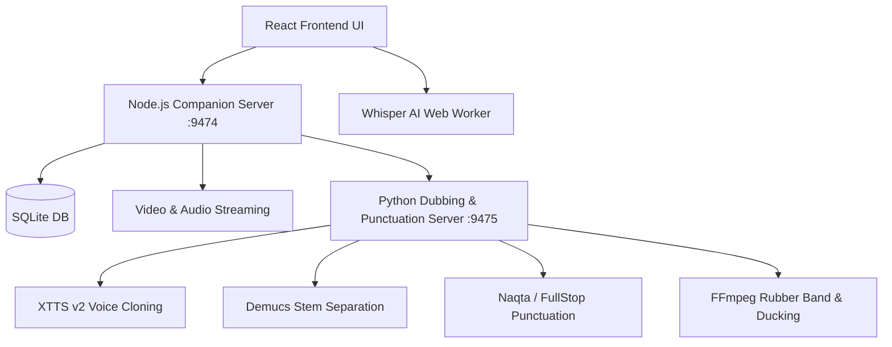
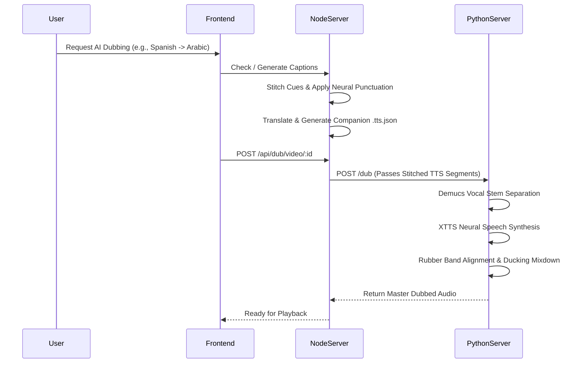

# TutIn v5.1 - Complete Technical Documentation

Welcome to the **TutIn Comprehensive Documentation**. This document covers everything from end-user installation instructions to the deep technical architecture, tech stack, data flows, and feature documentation. 

---

## 📋 Table of Contents
1. [Installation Guide](#1-installation-guide)
2. [Tech Stack & Architecture](#2-tech-stack--architecture)
3. [App Workflow & Data Flow](#3-app-workflow--data-flow)
4. [Detailed Features & Capabilities](#4-detailed-features--capabilities)
5. [Database Schema](#5-database-schema)
6. [API & Service Endpoints](#6-api--service-endpoints)
7. [Troubleshooting](#7-troubleshooting)

---

## 1. Installation Guide

### System Requirements
- **Node.js**: v18.0+
- **Browser**: Chrome, Edge, or Opera (for File System Access API)
- **RAM**: 8GB recommended for AI transcription features.
- **Python 3.9+ & FFmpeg** *(Optional)*: Required only if you plan to use the local AI Dubbing feature.

### Step-by-Step Setup

1. **Clone or Download** the repository:
   ```bash
   git clone https://github.com/noureldenadel/TutIn.git
   cd TutIn
   ```

2. **Install Node Dependencies**:
   ```bash
   npm install
   ```

3. **Configure API Keys (Optional)**:
   To enable AI Summarization via Gemini, open the app, click the **Settings** gear icon, navigate to the **AI** tab, and enter your OpenRouter API Key.
   *(Note: AI Transcription, Neural Punctuation, and Local Dubbing run entirely offline and do not require external API keys).*

4. **Start the Application**:
   ```bash
   npm start
   ```
   *(Or double click `start-dev.bat` on Windows)*. This command starts the backend Companion Server (on `http://127.0.0.1:9474`) and the Vite React frontend (on `http://localhost:3000`).

5. **Start AI Dubbing Service (Optional)**:
   If using the voice cloning feature:
   ```bash
   pip install -r python/requirements.txt
   python python/dubbing_server.py
   ```

---

## 2. Tech Stack & Architecture

TutIn is designed as an **Offline-First**, local-first application built with modern web technologies. It relies on local backend microservices to achieve high performance without cloud dependencies.

### Frontend
- **Framework**: React 18
- **Build Tool**: Vite 6
- **Styling**: Tailwind CSS, Lucide React (Icons)
- **Routing**: React Router 7
- **Video Player**: Native HTML5 Video, ReactPlayer, HLS.js, mpegts.js

### Backend / Local Services
- **Companion Server**: Express.js + SQLite. Runs locally on port `9474` to handle persistent file streaming, caption storage, and bypass browser origin isolation limits.
- **Dubbing & Neural Punctuation Server**: Python-based FastAPI server running on port `9475`. Utilizes `Coqui XTTS v2` for local AI voice cloning, Demucs for stem separation, transformers token classification for punctuation restoration, and FFmpeg for Rubber Band time-fitting and sidechain ducking.

### Local Storage & Persistence
- **SQLite Database**: Native SQLite DB managed by the Companion Server storing courses, modules, videos, notes, transcripts, and dub tracking.
- **IndexedDB**: Client-side storage fallback and watch sessions.
- **File System Access API**: Used to securely mount and traverse local directories without uploading files to a server.
- **.tutin Vault Folder**: Stores course-specific generated assets (like transcripts, companion `.tts.json` tracks, and dubbed audio files) directly inside the course directory.

### AI & Machine Learning Pipeline
- **Transcription**: `Transformers.js` (WebGPU accelerated with WASM fallback) running `Xenova/whisper-tiny` completely inside a non-blocking Web Worker.
- **Modular Neural Punctuation Restoration**:
  - Dedicated lightweight on-demand models: `MostafaMaroof/Naqta` for Arabic (~140MB) and `oliverguhr/fullstop-punctuation-multilang-large` for multilingual/Latin text.
  - Token-level remapping algorithm (`remapPunctuatedTextToCues`) transfers neural punctuation into original subtitle chunks without altering playback timestamps.
- **Dual-Transcript TTS vs. Caption Pipeline**:
  - Decouples visual subtitles from synthetic voice inputs. Standard `.vtt` retains clean grammatical text for reading, while companion `.tts.json` holds phonetically nudged dialect forms (e.g., Egyptian glottal stops `أُلتِلُه`, `دِلْوَأْتي` and Gulf colloquialisms `إِلْحِين`, `أَبِي`).
- **Summarization**: Gemini 2.0 Flash via OpenRouter REST API.
- **Dubbing & Translation Pipeline**:
  - **Sentence Stitcher**: Aggregates fragmented subtitle cues into complete grammatical sentences before translation and speech synthesis.
  - **Local Translation**: Distilled NLLB-200 (`Xenova/nllb-200-distilled-600M`) for offline translation; OpenRouter for dialectal Arabic.
  - **Voice Cloning (Coqui XTTS v2)**: Synthesizes cloned voice in 16+ languages with native speed pre-biasing ($0.88\times$ to $1.25\times$).
  - **Adaptive Time-Fitting**: Absorbs timing slack into natural silence gaps between cues (zero-stretch first), shaves internal non-speech pauses, and uses FFmpeg's `rubberband` filter for crisp, natural tempo corrections.
  - **Background Audio Preservation (Demucs)**: Opt-in 2-stem separation isolates original music and sound effects, ducking them under speech using FFmpeg's `sidechaincompress`.
  - **Active Process Cancellation**: Aborts background Whisper worker threads, cancels SSE translation streams, and alerts the Python backend to immediately stop synthesis.
  - **Performance Timing Debugger**: Console instrumentation logging granular breakdowns (`console.table`) for all AI processes.

---

## 3. App Workflow & Data Flow

### Overall Architecture Diagram



### Dual-Transcript & Dubbing Flow



---

## 4. Detailed Features & Capabilities

### 📚 Course Organization
- **Smart Directory Parsing**: Drop any folder into TutIn, and it will intelligently parse subfolders into Modules, sorting them alphanumerically.
- **Universal Importing**: Supports loading courses from Local Storage, YouTube Playlists, and Google Drive links.
- **Sync/Refresh**: Automatically detects new videos added to your local folder or deleted files without losing progress.
- **Visual Roadmap**: A global infinite canvas editor to map out course prerequisites and high-level learning paths.
- **Course Canvas**: A dedicated, course-specific infinite canvas (`CourseCanvasPage`) to visually organize modules, connect concepts, and view notes spatially.
- **Course Manager & Bulk Editor**: A dedicated bulk editor page (`CourseManagerPage`) to mass-manage playlists, edit titles, and queue bulk translation or dubbing tasks across multiple videos simultaneously.

### 🎬 Advanced Video Player
- **Cinematic Ambient Mode**: Local videos feature a dynamic, glowing ambient blur that extends the video's colors into the background.
- **Resume Playback**: Remembers your exact timestamp when you close the app.
- **Dual-Track Audio Sync**: Seamlessly syncs synthetic dub audio tracks with the native video player timeline, automatically handling pause, seek, and rate adjustments.
- **Dynamic Subtitles & Smart Captions**: Support for WebVTT/SRT with drag-and-drop repositioning.
- **Floating Mini Player**: Picture-in-picture mode inside the app while taking notes or navigating courses.

### 🧠 AI Toolkit
- **Offline Transcription**: Converts speech to text locally in your browser with smart transcript autocomplete.
- **Modular On-Demand Punctuation Restoration**: Recovers missing punctuation in uploaded or generated subtitles using dedicated language models (`Naqta` for Arabic, `FullStop-Multilang` for Latin).
- **Dual-Transcript Output**: Visual subtitles remain clean and concise (`.vtt`), while synthetic speech receives phonetically nudged companion tracks (`.tts.json`) for authentic dialect pronunciation.
- **Active Cancellation**: One-click cancel buttons in all AI dialogs immediately terminate Whisper workers, abort translation requests, and stop Python dubbing jobs.
- **Real-Time Performance Debuggers**: Logs structured `console.table` metrics displaying latency per cue and total pipeline durations.
- **Gemini Summaries**: Generates Markdown-formatted study notes from transcripts.
- **Local Voice Dubbing**: Auto-translates captions to 16+ languages and generates cloned audio tracks with Demucs stem isolation, sidechain ducking, and rubberband time-stretching.

### 📝 Notes & Annotations
- **Timestamped Markdown Notes**: Take rich-text markdown notes that lock to the current video timestamp. 
- **Smart Pauser**: Automatically pauses the video when you start typing a note, showing a countdown before resuming playback.
- **Image Support & Cropper**: Paste or drag screenshots directly into notes with inline cropping.
- **Persistent UI State**: Preserves your scroll position, active tabs, and unsaved note drafts.

### 💾 Data Storage & Backups
- **Full JSON Backups**: Export and import your entire database, notes, and progress to local JSON files (`tutin_backup_*.json`).

---

## 5. Database Schema

TutIn relies on `IndexedDB` for local, fast operations. Below is a simplified representation of the schema handled in `src/utils/db.js`:

| Store Name | Purpose | Key Fields |
|------------|---------|------------|
| `courses` | Top-level course metadata | `id`, `title`, `description`, `folderPath`, `thumbnail` |
| `modules` | Groups of videos | `id`, `courseId`, `title`, `order` |
| `videos` | Individual media files | `id`, `courseId`, `moduleId`, `title`, `duration`, `watchProgress`, `completed` |
| `notes` | User annotations | `id`, `videoId`, `timestamp`, `content` |
| `handles` | Persistent file permissions | `id`, `handle` |
| `roadmaps` | Visual learning paths | `id`, `name`, `nodes`, `edges` |
| `watch_sessions` | Granular viewing history | `id`, `videoId`, `startedAt`, `endedAt`, `durationWatched` |

---

## 6. API & Service Endpoints

### Express Companion Server (`:9474`)
- `GET /api/health` — Companion server health check, uptime, and database path.
- `GET /api/courses` / `POST /api/courses` — Course CRUD and directory rescanning.
- `GET /api/transcripts/:videoId` — Load multi-language subtitle tracks.
- `POST /api/transcripts/:videoId/translate` — Server-Sent Events (SSE) subtitle translation with companion `.tts.json` emission.
- `DELETE /api/transcripts/:videoId` — Remove subtitle tracks and clean up companion `.tts.json` files.
- `POST /api/dub/video/:videoId` — Submit dubbing job to Python backend.
- `GET /api/dub/video/:videoId/status` — Live dubbing status polling with performance timing payload.
- `POST /api/dub/video/:videoId/cancel` — Abort active dubbing job and update status.
- `GET /api/dub/service/status` & `POST /api/dub/service/start` — Python AI server lifecycle management.

### Python AI Dubbing Server (`:9475`)
- `GET /health` — Hardware diagnostics: CUDA availability, VRAM memory stats, active device.
- `POST /dub` — Background voice cloning synthesis, Demucs stem separation, and audio mixdown.
- `GET /status/{job_id}` — Job progress, step description, and execution duration metrics.
- `DELETE /job/{job_id}` — Immediate task cancellation flag.
- `POST /punctuate` — On-demand neural punctuation restoration via `Naqta` or `FullStop-Multilang`.
- `GET /models/punctuation` — List currently loaded in-memory punctuation models.

---

## 7. Troubleshooting

### Permission Denied / Cannot Restore Access
**Cause:** Browsers periodically revoke *file access permissions* for security reasons, or your course folder was moved/renamed on your hard drive. **Don't worry — your data and progress are completely safe!** The browser simply needs you to re-authorize its ability to read your local video files.
**Solution:** Go to **Settings → Data → Courses Folder**, click **Select Root Folder**, and re-select your main courses directory. All your progress and metadata will instantly re-link to the files.

### Port 3000 / 9474 Already in Use
**Cause:** Another application (or an old zombie instance of TutIn) is running on the default ports.
**Solution:** 
Kill the existing process or start the app on a different port:
```bash
npm run dev -- --port 3001
```

### AI Dubbing Server Fails to Start
**Cause:** Missing Python dependencies or FFmpeg not found in system PATH.
**Solution:**
Verify FFmpeg is installed by typing `ffmpeg -version` in your terminal. Ensure Python dependencies are installed using `pip install -r python/requirements.txt`.

---

<div align="center">
  <b>Built for learners who demand privacy, speed, and intelligence.</b>
</div>
