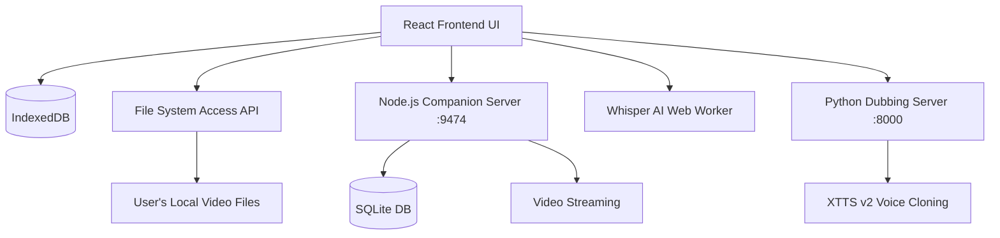
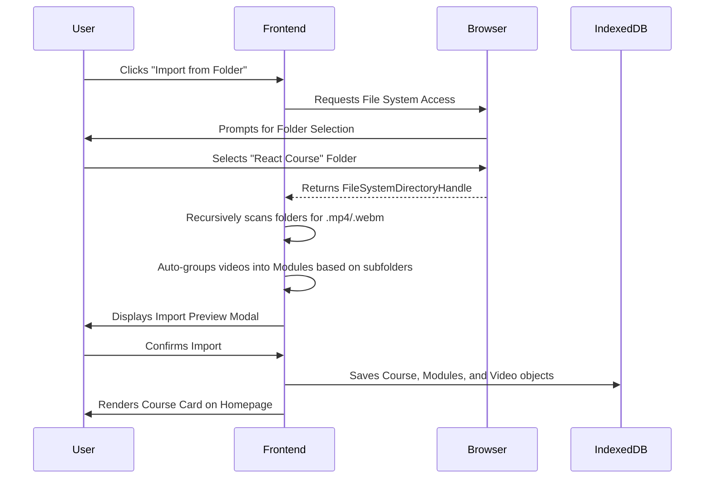
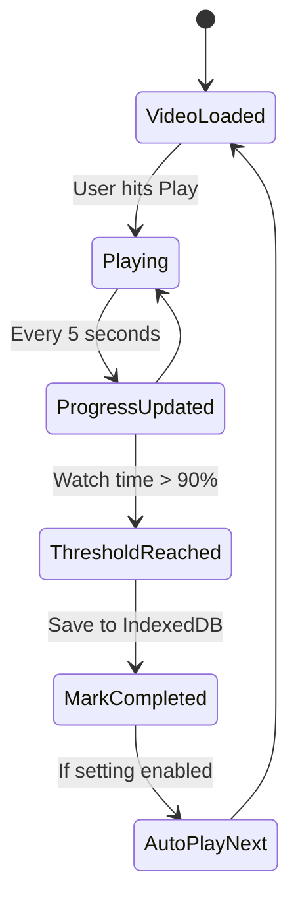

# TutIn v5 - Complete Technical Documentation

Welcome to the **TutIn Comprehensive Documentation**. This document covers everything from end-user installation instructions to the deep technical architecture, tech stack, data flows, and feature documentation. 

---

## 📋 Table of Contents
1. [Installation Guide](#1-installation-guide)
2. [Tech Stack & Architecture](#2-tech-stack--architecture)
3. [App Workflow & Data Flow](#3-app-workflow--data-flow)
4. [Detailed Features & Capabilities](#4-detailed-features--capabilities)
5. [Database Schema](#5-database-schema)
6. [Troubleshooting](#6-troubleshooting)

---

## 1. Installation Guide

### System Requirements
- **Node.js**: v18.0+
- **Browser**: Chrome, Edge, or Opera (for File System Access API)
- **RAM**: 8GB recommended for AI transcription features.
- **Python 3.9+ & FFmpeg** *(Optional)*: Required only if you plan to use the local AI Dubbing feature.

### Step-by-Step Setup

1. **Clone or Download** the repository:
   ```bash
   git clone https://github.com/noureldenadel/TutIn.git
   cd TutIn
   ```

2. **Install Node Dependencies**:
   ```bash
   npm install
   ```

3. **Configure API Keys (Optional)**:
   To enable AI Summarization via Gemini, open the app, click the **Settings** gear icon, navigate to the **AI** tab, and enter your OpenRouter API Key.
   *(Note: AI Transcription and Dubbing run entirely offline and do not require API keys).*

4. **Start the Application**:
   ```bash
   npm start
   ```
   This command starts the backend Companion Server (on `http://127.0.0.1:9474`) and the Vite React frontend (usually on `http://localhost:3000`).

5. **Start AI Dubbing Service (Optional)**:
   If using the voice cloning feature:
   ```bash
   pip install TTS fastapi uvicorn pydub
   python python/dubbing_server.py
   ```

---

## 2. Tech Stack & Architecture

TutIn is designed as an **Offline-First**, local-first application built with modern web technologies. It relies heavily on browser APIs to function without a traditional cloud backend.

### Frontend
- **Framework**: React 18
- **Build Tool**: Vite 6
- **Styling**: Tailwind CSS, Lucide React (Icons)
- **Routing**: React Router 7
- **Video Player**: Native HTML5 Video, ReactPlayer, HLS.js, mpegts.js

### Backend / Local Services
- **Companion Server**: Express.js + SQLite. Runs locally on port `9474` to handle persistent file streaming and overcome browser origin isolation limits.
- **Dubbing Server**: Python-based FastAPI server utilizing `Coqui XTTS v2` for local AI voice cloning and audio generation.

### Local Storage & Persistence
- **IndexedDB**: Primary client-side database storing all course metadata, module trees, progress arrays, notes, and roadmaps.
- **File System Access API**: Used to securely mount and traverse local directories without uploading files to a server.
- **.tutin Folder**: Stores course-specific generated assets (like transcripts and dubbed audio files) directly inside the course directory. The Sync feature automatically picks up files placed here.

### AI & Machine Learning
- **Transcription**: `Transformers.js` (WebGPU accelerated) running `Xenova/whisper-tiny` completely inside a Web Worker.
- **Summarization**: Gemini 2.0 Flash via OpenRouter REST API.
- **Dubbing/Translation**: Local NLLB-200 distillation for subtitle translation, and XTTS v2 for voice cloning. Includes Bulk Dubbing and translation workflows processed via background jobs. The dubbing engine features intelligent audio processing: it uses FFmpeg `atempo` filters to time-stretch generated audio into the original caption window (clamped between 0.5x and 1.5x), prevents segment overlapping, and applies a 20ms fade-in/fade-out to eliminate harsh clipping.
- **AI File Pipeline & Naming**: The pipeline operates in a sequence: *Whisper* -> *NLLB-200* -> *XTTS*. AI-generated files explicitly carry a `-generated.[lang]` suffix (e.g., `01-generated.en.vtt`), distinguishing them from user-uploaded captions (e.g., `01.es.vtt`).

---

## 3. App Workflow & Data Flow

### Overall Architecture Diagram



### Course Import Workflow



### Video Playback & Progress Tracking Flow



---

## 4. Detailed Features & Capabilities

### 📚 Course Organization
- **Smart Directory Parsing**: Drop any folder into TutIn, and it will intelligently parse subfolders into Modules, sorting them alphanumerically.
- **Universal Importing**: Supports loading courses from Local Storage, YouTube Playlists, and Google Drive links.
- **Sync/Refresh**: Click the sync icon to automatically detect new videos added to your local folder or deleted files, without losing progress.
- **Visual Roadmap**: A global infinite canvas editor to map out course prerequisites and high-level learning paths.
- **Course Canvas**: A dedicated, course-specific infinite canvas (`CourseCanvasPage`) that allows you to visually organize modules, connect concepts, and view notes spatially.
- **Course Manager & Bulk Editor**: A dedicated bulk editor page (`CourseManagerPage`) to mass-manage playlists, edit titles, and queue bulk translation or dubbing tasks across multiple videos simultaneously.

### 🎬 Advanced Video Player
- **Cinematic Ambient Mode**: Local videos feature a dynamic, glowing ambient blur that extends the video's colors into the background for a more immersive viewing experience.
- **Resume Playback**: Remembers your exact timestamp when you close the app.
- **Dynamic Subtitles & Smart Captions**: Support for WebVTT/SRT with drag-and-drop repositioning. Smart Captions auto-detects and suggests other subtitle files in the same folder.
- **Speed & PiP**: Quick speed toggles, hold-to-fast-forward, and a custom Floating Mini Player for picture-in-picture mode inside the app while taking notes or navigating.

### 🧠 AI Toolkit
- **Offline Transcription**: Converts speech to text locally in your browser with smart transcript autocomplete. Generates clickable timestamps that seek the video.
- **Gemini Summaries**: Generates Markdown-formatted study notes from transcripts.
- **Local Voice Dubbing**: Auto-translates captions to 16+ languages and generates cloned audio tracks. Queue bulk tasks to dub entire modules in the background.

### 📝 Notes & Annotations
- **Timestamped Markdown Notes**: Take rich-text markdown notes that lock to the current video timestamp. 
- **Smart Pauser**: Automatically pauses the video when you start typing a note. Once you stop writing, a visual countdown timer initiates before seamlessly resuming playback.
- **Image Support & Cropper**: Paste or drag screenshots directly into notes. Use the Inline Image Cropper to edit screenshots instantly (auto-compressed and stored locally as Base64).
- **Persistent UI State**: The sidebar intelligently preserves your scroll position, active tabs, and unsaved note drafts when switching between the Playlist, AI, and Notes panels.

### 💾 Data Storage & Backups
- **Full JSON Backups**: Seamlessly export and import your entire database, notes, and progress to a local JSON file (e.g., `tutin_backup_2026.json`). This ensures you own your data and can migrate between devices easily.

---

## 5. Database Schema

TutIn relies on `IndexedDB` for local, fast operations. Below is a simplified representation of the schema handled in `src/utils/db.js`:

| Store Name | Purpose | Key Fields |
|------------|---------|------------|
| `courses` | Top-level course metadata | `id`, `title`, `description`, `folderPath`, `thumbnail` |
| `modules` | Groups of videos | `id`, `courseId`, `title`, `order` |
| `videos` | Individual media files | `id`, `courseId`, `moduleId`, `title`, `duration`, `watchProgress`, `completed` |
| `notes` | User annotations | `id`, `videoId`, `timestamp`, `content` |
| `handles` | Persistent file permissions | `id`, `handle` |
| `roadmaps` | Visual learning paths | `id`, `name`, `nodes`, `edges` |
| `watch_sessions` | Granular viewing history | `id`, `videoId`, `startedAt`, `endedAt`, `durationWatched` |

---

## 6. Troubleshooting

### Permission Denied / Cannot Restore Access
**Cause:** Browsers periodically revoke *file access permissions* for security reasons, or your course folder was moved/renamed on your hard drive. **Don't worry — your data and progress are completely safe!** The browser simply needs you to re-authorize its ability to read your local video files.
**Solution:** Go to **Settings → Data → Courses Folder**, click **Select Root Folder**, and re-select your main courses directory. All your progress and metadata will instantly re-link to the files.

### Port 5173 / 9474 Already in Use
**Cause:** Another application (or an old zombie instance of TutIn) is running on the default ports.
**Solution:** 
Kill the existing process or start the app on a different port:
```bash
npm run dev -- --port 3001
```

### AI Dubbing Server Fails to Start
**Cause:** Missing Python dependencies or FFmpeg not found in system PATH.
**Solution:**
Verify FFmpeg is installed by typing `ffmpeg -version` in your terminal. Ensure Python dependencies are installed using `pip install TTS fastapi uvicorn pydub`.

---

<div align="center">
  <b>Built for learners who demand privacy, speed, and intelligence.</b>
</div>
